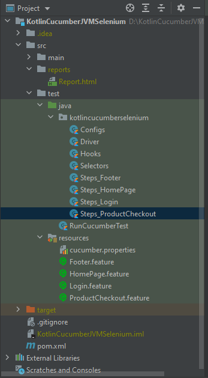

# CucumberJVMSelenium
This repo has the code which implements a Selenium Test framework using BDD (Cucumber-JVM) and Kotlin for the website, https://www.saucedemo.com/

Project setup guide is available in the PDF doc [KotlinCucumberJVMSelenium.pdf](KotlinCucumberJVMSelenium.pdf)

### **Folder Structure**

